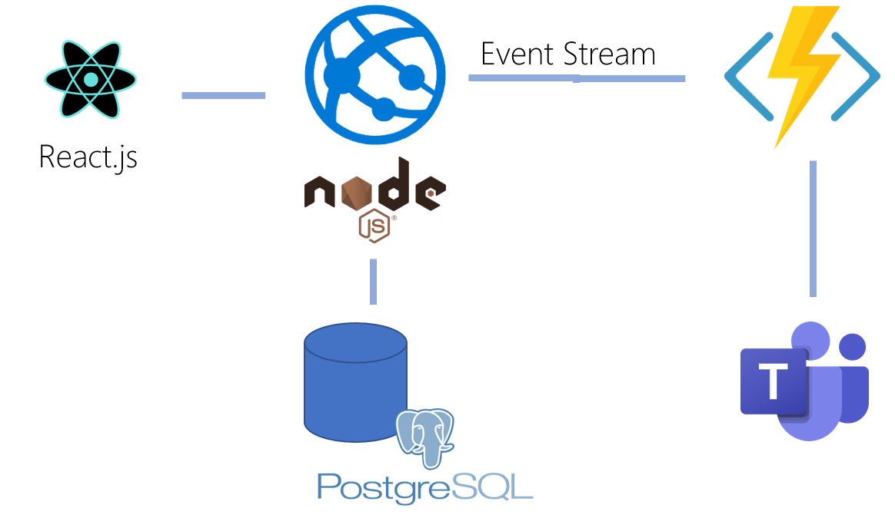

# Welcome to the React.js and serverless accelerator

This accelerator implements a [node.js (Express) webapp with a React.js frontend](src/webapp), hosted as an [Azure Web app](src/arm/webapp.bicep) backed by a [PostgreSQL database](src/arm/postgres.bicep).  Events from the React.js site will invoke background functions implemented as Azure Functions and invoke a webhook in Teams.

**NOTE:** Check [below](#required-to-get-started) for required secrets and changes to get started

To get started, simply open the repository in Codespaces and start [debugging](.vscode/launch.json).
This is possible because the accelerator has a development environment [defined in a container (a .devcontainer)](.devcontainer). There are [database migration and seed data processes](src/webapp/db_migration) configured to run [when your devcontainer starts](.devcontainer/devcontainer.json), so expect some data to show up.

The webapp has a single model and [route implemented](src/webapp/routes/item.js). You can simply go ahead and add your business model and logic to the app.

Most of the routines you would want to run when developing are implemeted as [make targets](makefile), so simply invoke 'make build' to build the application, or use [VS Code tasks](.vscode/tasks.json) to run 'make test' - and checkout the [testing framework](src/webapp/test) implemented.

On checkins, the [app builds](.github/workflows/build_bundle.yaml) and a [Porter bundle](src/bundle) is being created and pushed to a [registry]() (To be implemented in [#11](https://github.com/varaderoproject/webapp-nodejs/issues/11)).

In order to deploy the application and all the required resources, checkin a change to an [environment file]() (To be implemented #11). The [environment file]() also includes all the parameters used for that deployment.

## Required to get started

1. Setup an ARC-enabled Kubernetes cluster, by following [these instructions](https://github.com/microsoft/Azure-App-Service-on-Azure-Arc/blob/main/docs/getting-started/setup.md). The [src/arc/lima-setup.sh](src/arc/lima-setup.sh) script can help, but check the setup instructions in the above link, as these change frequently.

1. Enable CNAB bundle support in GitHub
    1. Follow [this guide](https://docs.github.com/en/free-pro-team@latest/packages/guides/enabling-improved-container-support) to enable support for CNAB on GitHub

1. Set following deployment time parameters as GitHub secrets
    | Parameter | GitHub Secret | Description |
    | --- | --- | --- |
    | Teams Webhook | `TEAMS_WEBHOOK_URL` | Create a Team Channel and add an `Incoming Webhook` connector. |
    | Package admin | `PACKAGE_ADMIN` | Create a [personal access token](https://docs.github.com/en/free-pro-team@latest/github/authenticating-to-github/creating-a-personal-access-token#creating-a-token) with 'write:packages' permissions and save the value to this secret |
    | Azure credentials | `AZURE_CREDENTIALS` | `az login -o none && az ad sp create-for-rbac --role contributor --sdk-auth` |
    | Postgres admin password | `POSTGRES_DB_ADMIN_PASSWORD` | Configure what postgres database admin password you want to use - [more info](https://docs.microsoft.com/en-us/azure/postgresql/concepts-security#access-management) by saving the password to a [GitHub Secrets](https://docs.github.com/en/free-pro-team@latest/actions/reference/encrypted-secrets#creating-encrypted-secrets-for-a-repository) name |

1. Check the environment.yaml file. For ARC deployments, ensure to include the correct App Service Environment to use. The syntax is commented in the file.

1. Run the build workflow, this will eventually kick-off the deployment workflow as well.
